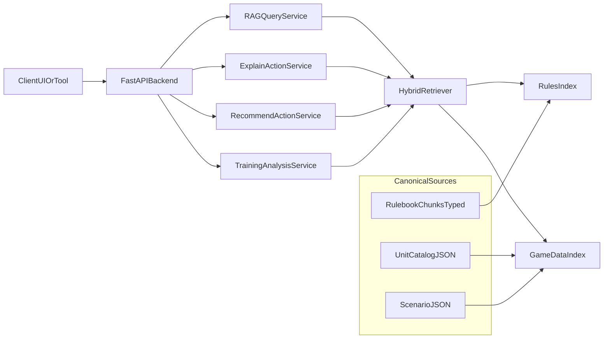

# RAG Copilot Architecture

## Core Modules

- `assault_rag/copilot/index_builder.py`
  - builds/loads `game_data_chunks.json`,
  - loads rules chunks from rulebook sources.
- `assault_rag/copilot/retriever.py`
  - query-mode classification (`rules|data|hybrid`),
  - evidence retrieval with token-overlap ranking.
- `assault_rag/copilot/services.py`
  - answer composition,
  - short explainability,
  - live recommendation ranking,
  - training level-1 analysis.

## Evidence Contract

Every user-facing output should include:
- `source_type` (`rule` or `data`),
- `source_id`,
- `snippet`,
- optional `limitations`.

## Safety Policy

- If evidence is insufficient, return explicit limitation (`NO_EVIDENCE`-style behavior).
- Recommendations are advisory only.
- Training module is offline/post-hoc (no policy online intervention).
