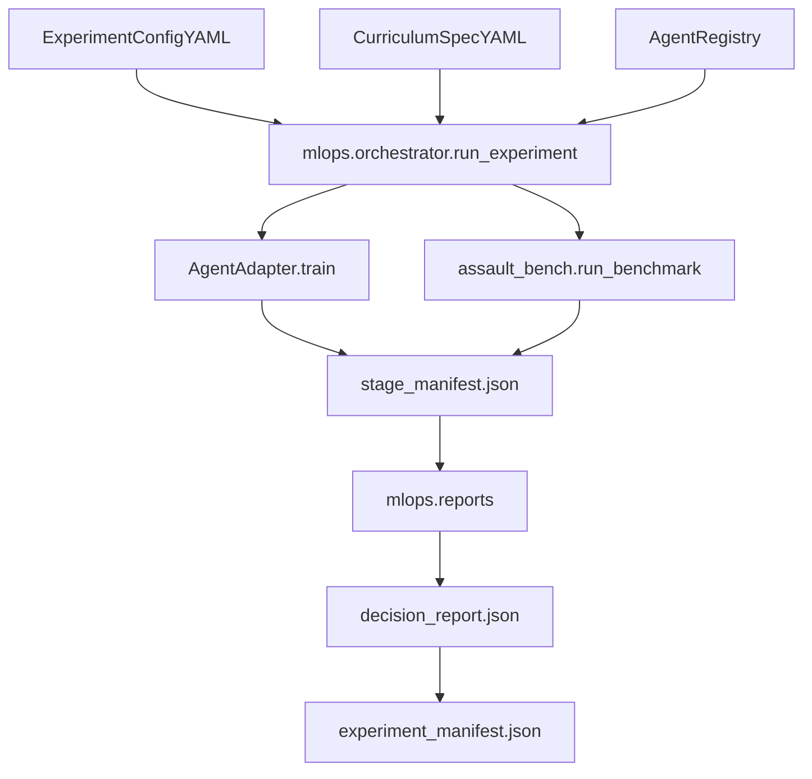

# 01 Architecture

Validation state: **Pending Validation**.

## Execution Graph

## Module Responsibilities

- `mlops/contracts.py`: typed contracts for curriculum and experiment config.
- `mlops/config_loader.py`: experiment loader and path resolution.
- `mlops/curriculum/io.py`: curriculum loader and stage parsing.
- `mlops/registry/default_registry.py`: default registry and adapters.
- `mlops/orchestrator/run.py`: train->benchmark->decision orchestration.
- `mlops/orchestrator/prefect_flow.py`: optional Prefect wrapper.
- `mlops/reports.py`: comparison and decision payload builders.

## Output Artifacts

- `runs/experiments/<experiment_id>/experiment_manifest.json`
- `runs/experiments/<experiment_id>/comparison_summary.json`
- `runs/experiments/<experiment_id>/decision_report.json`
- `runs/experiments/<experiment_id>/<stage_name>/stage_manifest.json`

## Reporting v2 Separation

The reporting catalog explicitly separates:

- `engine/model` identity layer (e.g., `sb3`, `muzero`, `alpha`)
- `train_history` lineage (including retrain parent run from resume checkpoint)
- `eval_history` linked to train run snapshots
- commit association (`mlflow.source.git.commit`) when available

For Objective Decision Flow traceability, each `eval_history` row now carries:

- `flow_traceability.flow_source = "eval"`
- `flow_traceability.flow_contract_version = "phase_2_9_eval_kpis.v1"`
- `flow_traceability.flow_available` + `flow_traceability.flow_fields`
- `diagnostics_summary_eval` (raw eval-side diagnostics payload)

Catalog artifact:

- `runs/experiments/reporting/model_catalog_latest.json`
